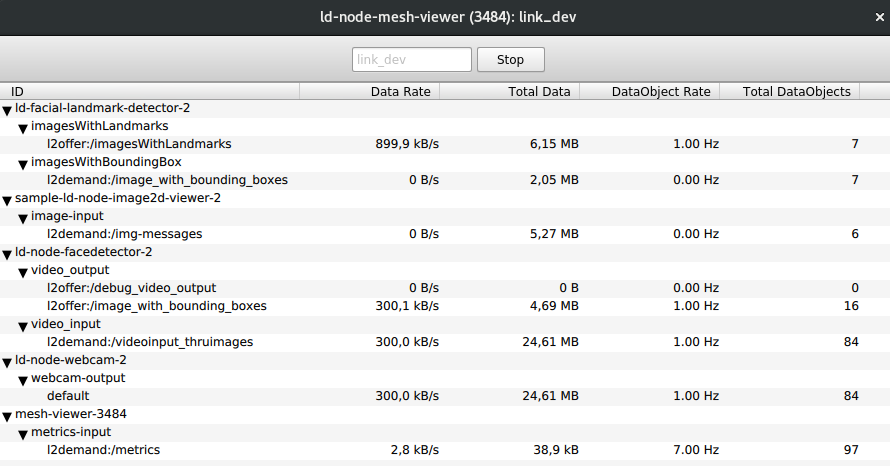

# ld-node-facial-landmark-detector-2

[](https://gitlab.com/link.developers.beta/ld-node-facial-landmark-detector-2/commits/master)

## Motivation and Context

- This node requires an input in the form:

```
//Contains an Image and one or more set(s) of co-ordinates that define a bounding box 
//inside the image.
table ImageWithBoundingBoxes
{
    imageWithFace : link_dev.Image;  //Image in which the bounding boxes have been defined.
    boxes : [BoundingBox];           //An array of bounding boxes. 
    numBoundingBoxes : int;          //Number of bounding boxes.
}
```
where BoundingBox is basically:
```
table BoundingBox
{
    x_coordinate : int32; //x co-ordinate of top left corner of the bounding box.
    y_coordinate : int32; //y co-ordinate of top left corner of the bounding box.
    width : int32;        //width of the bounding box.
    height : int32;       //height of the bounding box.
}

```

- The bounding box is used to mark faces which are detected in the image. The link node [ld-node-face-detector-2](https://gitlab.com/ritwikgh/ld-node-facial-landmark-detector-2) outputs such data. Note that this node (and ld-face-detector-2 as well) are designed to work on a stream of images. Thus, the video output from a camera can be used to supply an input stream of images and every frame of the video will be scanned for faces (by ld-node-facedetector-2) and subsequently facial landmarks can be also marked by this node in real time (assuming a processor and GPU fast enough to do so).

- Once this input is provided to this node, it uses tensorflow library and prebuilt models to determine "68 face key points" on the image of face supplied. 

- The prebuilt models are read from a protobuf file which is included in the project as `prnet_frozen.pb`. This model was most likely generated using [this project](https://github.com/YadiraF/PRNet) or its [C++ port](https://github.com/lighttransport/prnet-infer).


## The node in action

- One possible configuration to run this node would be:
  - ld-node-image2d-viewer-2
  - ld-node-facedetector-2
  - ld-node-webcam-2
  - ld-node-facial-landmark-detector-2

- In this sample configuration, the output of the webcam is fed into the facedetector; which marks the faces and creates an output of `ImageWithBoundingBox` which in turn gets fed into facial-landmark-detector-2. If the `Visualize` parameter on ld-node-facial-detector-2 is set to `true`, the ld-image-viewer-2 would output a live feed of video in which the facial features are marked with a superimposed set of points and lines.
- This is what what the ld-node-mesh-viewer shows with the above configuration:


## Configuration Parameters
- `Visualize` - boolean - Determines if the detected facial key points should be output as superimposed on the image or not.
- `PathToUVData` - string - Path to the location of uv_indices data file which is obtained from [this project](https://github.com/YadiraF/PRNet). 
- `PathToModel` - string - Path to the prebuilt model file in form of protobuf file which is most likely obtained using [this project](https://github.com/YadiraF/PRNet)[1] or its [C++ port](https://github.com/lighttransport/prnet-infer)[2].

## Installation

```
conda install ld-node-facial-landmark-detector-2
```

## Usage example

```
ld-node-facial-landmark-detector-2 --instance-file instance.json
```

## Specification

This node implements the following RFCs:
- https://draive.com/link_dev/rfc/027/README/index.html

## Contribution

Your help is very much appreciated. For more information, please see our [contribution guide](./CONTRIBUTING.md) and the [Collective Code Construction Contract](https://gitlab.com/link.developers/RFC/blob/master/001/README.md) (C4).

## References
- [1]  https://github.com/YadiraF/PRNet
- [2]  https://github.com/lighttransport/prnet-infer/blob/master/README.md

## Maintainers

- Ritwik Ghosh (maintainer, original author)
- Based upon [link node](https://gitlab.com/link.developers.beta/ld-node-facial-landmark-detector) written by Renzhou Ge.
